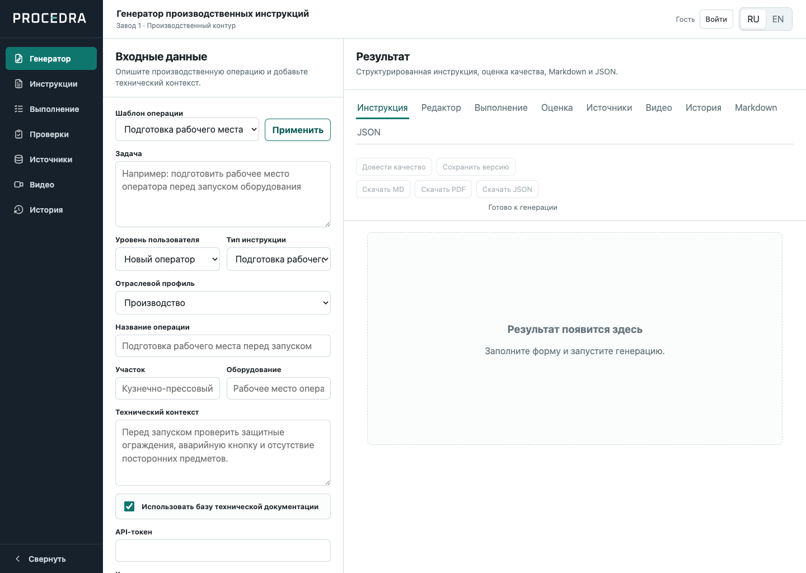
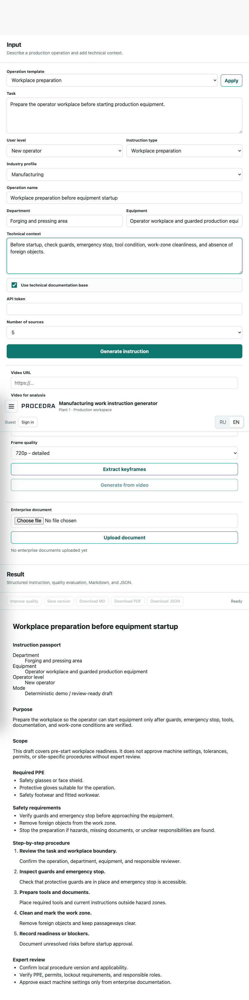
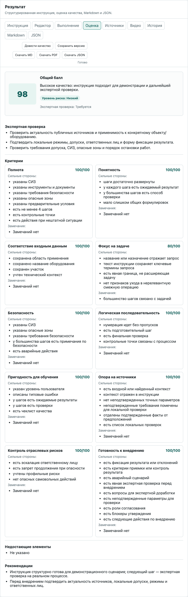
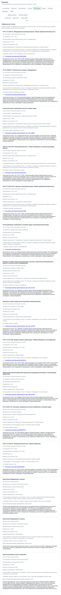
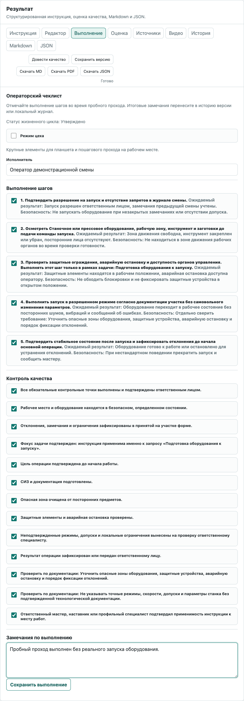
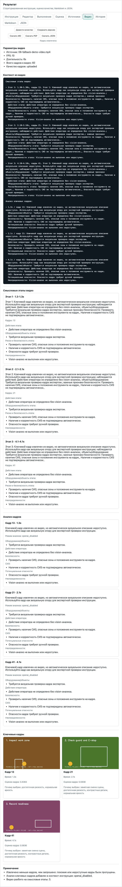
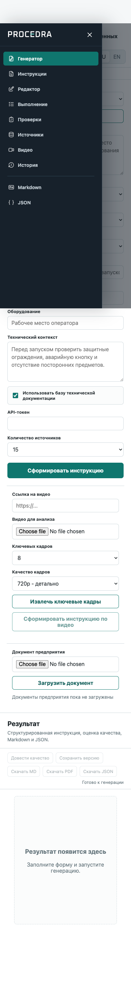

# Procedra — Industrial Instruction AI

Procedra is a FastAPI-based AI product prototype for generating review-ready industrial work instructions from an operator request, technical context, enterprise documents, public reference sources, and video-derived context.

The project is intentionally built as more than a text generator: it demonstrates an end-to-end workflow from structured generation to source grounding, deterministic quality evaluation, expert review, version history, execution checklist evidence, audit trail, and PDF/Markdown/JSON export.

> Current release status: controlled local demo / partner walkthrough prototype.
> Not approved for internet-facing production deployment or regulated enterprise data storage.



## Why this project exists

Industrial instructions are often prepared manually by technologists, engineers, shift supervisors, and safety specialists. That process is slow, inconsistent, hard to update, and difficult to trace back to source materials or reviewer decisions.

Procedra explores a practical AI workflow for this problem:

- generate a structured instruction draft from a narrow operational request;
- keep exact machine settings, tolerances, permits, and responsible roles out of the AI output unless they are confirmed;
- expose source context, local verification items, and expert-review questions;
- require human review before any real-world use;
- preserve versions, decisions, execution evidence, and audit events.

## Product capabilities

- Russian industrial instruction generation with structured JSON validation.
- Human-readable Markdown and PDF export.
- Bilingual RU/EN single-page web interface.
- Deterministic fallback when OpenAI is disabled, unavailable, or returns invalid JSON.
- Deterministic quality evaluation with criterion-level scores and recommendations.
- Request-focus and quality-improvement passes that keep the result tied to the exact user request.
- Industry profiles and operation templates for manufacturing, safety, emergency response, utilities, transport, food production, information security, and other workplace scenarios.
- Hybrid semantic/keyword retrieval over local and uploaded documents.
- Enterprise document upload and indexing for `.txt`, `.md`, and text-based `.pdf`.
- Curated public-source retrieval with authority/source metadata and influence scoring.
- Local and URL video processing with metadata, subtitles/transcripts where available, keyframes, semantic stages, optional frame-level vision analysis, and deterministic fallback.
- SQLite-backed accounts, organizations, projects, sessions, roles, invitations, and admin audit.
- Instruction history, reviewer workflow, execution checklist runs, and summary metrics.
- Stable API error envelopes, request IDs, security headers, optional API token protection, rate limiting, readiness, metrics, and structured redacted JSON logs.
- Docker Compose local demo with persistent named volumes.

## Screenshots

| Instruction result | Quality evaluation |
|---|---|
|  |  |

| Source grounding | Execution checklist |
|---|---|
|  |  |

| Video-derived context | Mobile navigation |
|---|---|
|  |  |

## Architecture at a glance

```text
User request
  + technical context
  + enterprise docs
  + public sources
  + video metadata / transcript / keyframes
        ↓
Retrieval + request focus + prompt construction
        ↓
AI generation or deterministic fallback
        ↓
JSON parsing + Pydantic validation
        ↓
Quality improvement + deterministic evaluation
        ↓
Instruction + sources + PDF/Markdown/JSON
        ↓
Version history + review workflow + execution evidence + audit trail
```

Key implementation areas:

- API: `app/main.py`, `app/api/`
- Schemas: `app/schemas/`
- Generation pipeline: `app/generation/`
- Retrieval: `app/retrieval/`
- Video/keyframes: `app/vision/`
- Auth/storage/audit/metrics: `app/storage/`, `app/core/`
- Web UI: `app/static/`
- Tests: `tests/`
- Demo and project docs: `docs/`
- Local/private generated evidence: `reports/`

See also:

- [Architecture](docs/architecture.md)
- [Project specification](docs/project_spec.md)
- [Partner demo flow](docs/partner_demo.md)
- [Demo script](docs/procedra_demo_script.md)
- [Production readiness](docs/production_readiness.md)
- [Portfolio case study](docs/case_study.md)
- [Pilot offer for customer review](docs/procedra_pilot_for_customer.md)
- [Pilot outreach messages](docs/procedra_outreach_messages.md)
- [GitHub publication checklist](docs/github_publication.md)

## Quick start

Python 3.12 is the supported local runtime and matches Docker/CI.

```bash
python3.12 -m venv .venv
source .venv/bin/activate
pip install -r requirements.txt
cp .env.example .env.local
uvicorn app.main:app --reload
```

Open:

```text
http://127.0.0.1:8000/
```

The default demo configuration is deterministic and does not require OpenAI credentials. For OpenAI-backed generation, embeddings, and vision analysis, configure `.env.local`:

```text
OPENAI_ENABLED=true
OPENAI_API_KEY=...
```

Never commit `.env.local`, generated databases, uploads, or runtime artifacts.

## Docker local demo

```bash
docker compose up --build
```

Compose binds to `http://127.0.0.1:8000/` by default and stores generated/uploaded runtime data in named volumes.

Smoke checks:

```bash
curl http://127.0.0.1:8000/health
curl http://127.0.0.1:8000/ready
curl http://127.0.0.1:8000/metrics
```

## Verification commands

```bash
make compile
make lint
make typecheck
make test
make pip-check
make docker-config
make smoke
make demo-eval
make partner-demo-pack
```

The latest local verification before this publication-prep baseline recorded 318 passing tests plus Ruff, strict mypy, compileall, dependency integrity, Compose/API smoke, demo evaluation, and partner-demo-pack generation. Detailed local audit artifacts are kept in the non-published `reports/` workspace folder.

## Demo evaluation

```bash
make demo-eval
```

The deterministic demo pack runs 15 cross-domain scenarios and writes:

- `reports/demo_eval_report.json`
- `reports/demo_eval_report.md`

For a controlled industrial partner walkthrough:

```bash
make partner-demo-pack
```

This creates a reproducible synthetic evidence pack under the local `reports/partner_demo_pack/` folder with instruction JSON/Markdown/PDF, lifecycle evidence, audit trail, execution run, fallback video, keyframes, and a talk track.

## Research artifact

Procedra is also packaged as a research-informed software artifact for human-in-the-loop industrial AI. The current working paper and SSRN submission materials are kept under [`docs/research/`](docs/research/):

- [`procedra_ssrn_working_paper.md`](docs/research/procedra_ssrn_working_paper.md) — working paper source.
- [`procedra_ssrn_submission_package.md`](docs/research/procedra_ssrn_submission_package.md) — copy-paste metadata for SSRN.
- [`procedra_ssrn_final_upload_checklist_for_alexander.md`](docs/research/procedra_ssrn_final_upload_checklist_for_alexander.md) — final submission checklist.

The paper frames the project as a controlled local-demo prototype and source-supported workflow artifact. It does not claim production deployment, certified compliance, customer validation, revenue, measured productivity gains, or replacement of qualified expert review.

## API example

```bash
curl -X POST http://127.0.0.1:8000/api/instructions/generate \
  -H "Content-Type: application/json" \
  -d '{
    "task": "Подготовить рабочее место оператора перед запуском оборудования",
    "user_level": "new_operator",
    "instruction_type": "workplace_preparation",
    "industry_profile": "manufacturing",
    "department": "Кузнечно-прессовый участок",
    "equipment": "Производственное оборудование участка",
    "operation_name": "Подготовка рабочего места перед запуском оборудования",
    "technical_context": "Перед запуском необходимо проверить состояние инструмента, ограждений и аварийной кнопки."
  }'
```

## Accounts and roles

Procedra includes a lightweight SQLite account layer for demo and pre-production use.

Roles:

- `operator`
- `master`
- `technologist`
- `safety`
- `quality`
- `admin`

Browser login uses HttpOnly cookies and CSRF protection. API clients may use bearer sessions. Production mode fails fast unless public registration and role self-assignment are disabled and privileged provisioning is configured.

Stored documents, instructions, videos/keyframes, audits, and execution records are scoped by organization and project. See [Authorization](docs/authorization.md).

## Security and production-readiness notes

The repository is suitable for a controlled local demonstration and technical review. It is not presented as production-ready SaaS.

Important boundaries:

- generated instructions are AI drafts until reviewed by qualified enterprise roles;
- current public sources are references, not legal applicability guarantees;
- exact equipment settings and regulated requirements must come from approved customer materials;
- demo mode is intentionally permissive for walkthroughs;
- internet-facing deployment requires additional hardening, monitoring, backup, retention, secret-management, and vulnerability-scanning work.

Detailed status: [Production readiness](docs/production_readiness.md).

## What this project demonstrates

For portfolio and partner-review purposes, Procedra demonstrates:

- product thinking around a concrete industrial workflow;
- AI system design with validation, fallback, grounding, and reviewer boundaries;
- backend engineering with FastAPI, Pydantic, SQLite, Docker, and CI-oriented gates;
- retrieval and video-processing pipelines;
- security/production-readiness thinking: auth, roles, project isolation, rate limiting, structured logging, readiness, metrics, and audit trail;
- disciplined documentation and evidence packaging for enterprise-style evaluation.

## License

License is not selected yet. Before public release, choose whether this repository should be:

- source-available portfolio code with all rights reserved;
- MIT/Apache-2.0 open source;
- private repository shared selectively with partners or recruiters.
