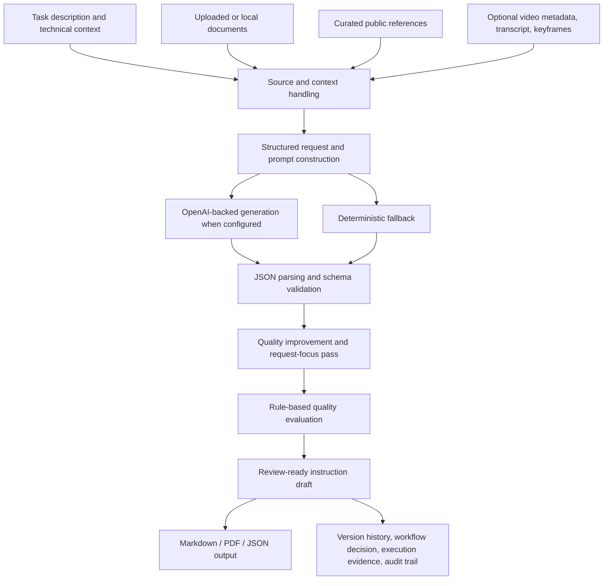

# Procedra: A Source-Supported Software Artifact for Human-in-the-Loop Industrial AI

Author:
Aleksander Shuvalov
Affiliation: South Ural State University, Center for Elite IT Training "Digital Ural"
Email: shuv.aleksandr@icloud.com
Date written: June 29, 2026

## Abstract

Industrial work instructions are often created through document-heavy workflows that require engineers, technologists, supervisors, and safety specialists to coordinate task context, local procedures, source materials, and reviewer decisions. Plain large language model generation is not sufficient for this setting because fluent procedural text can obscure missing information, unsupported assumptions, and accountability boundaries. This working paper presents Procedra, a source-supported software artifact and controlled local-demo prototype for human-in-the-loop industrial AI. Positioned as an early-stage design-science artifact, Procedra transforms task descriptions, technical context, enterprise documents, curated public references, and optional video-derived signals into structured, review-ready work-instruction drafts. The prototype combines schema-validated generation, deterministic fallback behavior, retrieval-based context handling, rule-based quality evaluation, local verification prompts, expert-review questions, version history, workflow decisions, execution checklist evidence, and audit events. The paper contributes a bounded artifact description, a source-supported drafting workflow pattern, and an evidence protocol that separates implementation evidence from customer, field, safety, and compliance validation. It does not claim production deployment, certified compliance, measured productivity gains, or replacement of approved local procedures and qualified expert review.

## Keywords

Industrial AI; human-in-the-loop AI; work instructions; large language models; retrieval-augmented generation; source grounding; traceability; quality evaluation; manufacturing documentation; software artifact; audit trail; AI product engineering.

## 1. Introduction

Industrial work instructions translate operational knowledge into repeatable action. In manufacturing and other document-heavy B2B environments, instruction preparation can involve task context, equipment notes, local procedures, source documents, safety requirements, reviewer decisions, and execution evidence. These materials are often fragmented across documents, teams, and operational systems. The result is not only a writing problem, but a coordination and accountability problem.

Large language models can assist with procedural drafting, but plain text generation is a weak fit for high-accountability operational settings. A generated instruction can sound fluent while omitting source limitations, inventing unsupported parameters, failing to ask local verification questions, or obscuring the need for qualified review. Prior work on retrieval-augmented generation, human-AI interaction, trustworthy AI, and hallucination risk suggests that generative systems need careful grounding, user oversight, transparency, and risk controls when used in consequential workflows [4-10].

Procedra explores this problem as a software artifact. The artifact is designed to support, not replace, human industrial review. It generates structured work-instruction drafts from operational inputs and available context, then exposes validation, local verification, expert-review, and traceability boundaries around the draft. Following design-science research conventions, the paper treats Procedra as an instantiation and early design pattern whose value can be discussed through problem relevance, artifact design, demonstration evidence, and explicit evaluation limits [1-3]. The paper describes the system architecture, implemented workflow, evidence protocol, limitations, and future validation path.

The contribution is intentionally bounded. Procedra is not presented as a certified industrial safety system, a production SaaS platform, a customer-validated product, or an autonomous approval tool. It is presented as a source-supported prototype for human-in-the-loop industrial AI and as a concrete artifact for studying review-ready instruction drafting.

The paper makes three specific contributions:

1. It describes a working artifact for transforming fragmented industrial context into structured, review-ready work-instruction drafts.
2. It proposes a source-supported drafting workflow pattern that combines generation, deterministic fallback, schema validation, quality checks, expert-review questions, workflow state, execution evidence, and audit traceability.
3. It defines an evidence boundary for early-stage industrial AI artifacts by separating repository-confirmed implementation evidence from future customer, field, safety, compliance, and business-impact validation.

## 2. Problem Statement

Procedra addresses the problem of transforming tasks, documents, source materials, and contextual signals into review-ready industrial work instructions.

This problem has five practical requirements:

1. Inputs are heterogeneous. A useful draft may depend on task descriptions, technical context, uploaded documents, public references, and optional video-derived signals.
2. Outputs need structure. Industrial instructions require fields such as purpose, scope, PPE, hazards, prerequisites, numbered steps, expected results, verification methods, control points, emergency actions, quality checks, and review blockers.
3. Missing information is operationally meaningful. Exact settings, tolerances, permits, legal applicability, responsible roles, and site-specific procedures should not be invented by an AI system.
4. Human review is mandatory. Supervisors, technologists, safety specialists, quality specialists, or administrators may need different authority in the review process.
5. Traceability matters. Draft versions, reviewer decisions, execution records, source context, and audit events should remain connected.

The target output is therefore not a final approved procedure. It is a review-ready draft that makes the boundary between AI assistance and human decision-making explicit.

## 3. System Overview

Procedra is an AI workflow prototype and source-supported software artifact. The repository describes the current release status as a controlled local demo / partner walkthrough prototype. It is not presented as an internet-facing production system, an enterprise-ready platform, a customer-validated solution, or a proven automation product.

The implemented artifact includes:

- structured industrial work-instruction generation;
- schema validation through Pydantic models;
- OpenAI-backed generation when configured;
- deterministic fallback when model access is disabled, unavailable, invalid, or fails schema validation;
- retrieval/context handling over uploaded/local documents and curated public sources;
- optional video-derived context, including metadata, transcripts/subtitles, keyframes, and optional frame-level analysis;
- deterministic rule-based quality evaluation;
- local verification prompts and expert-review questions;
- Markdown, PDF, and JSON-oriented outputs;
- version history, workflow transitions, execution checklist evidence, and audit events;
- role and project boundaries for the controlled demo context.

The design premise is that a useful industrial AI workflow should wrap generation in constraints. The artifact therefore combines generation with structure, evaluation, review boundaries, and traceability.

## 4. Architecture and Workflow

Procedra follows a source-supported drafting workflow. Inputs are collected from a task request and optional context sources. The system constructs context, generates or falls back to a deterministic instruction, validates the output, improves and focuses the draft, evaluates quality, and returns a review-ready artifact that can be saved into a workflow.

The generation layer is designed to avoid unsupported specificity. The system prompt instructs generation to separate observed facts from assumptions, list missing local parameters, include expert-review questions, and avoid inventing machine settings, tolerances, standards, approvals, or responsible roles when they are absent from the input evidence.

The retrieval layer supports source/context handling rather than independent factual validation. In this paper, "source-supported" means that retrieved or provided context can be incorporated into the draft and surfaced for review. It does not mean that factual grounding has been externally benchmarked or that the output is automatically safe for operation.

## 5. Evidence and Evaluation

In design-science terms, the current evidence should be read as artifact demonstration and early evaluation rather than complete organizational or field validation. The aim is to show that the artifact exists, implements the stated workflow pattern, and can be exercised in controlled local-demo conditions. Stronger claims would require expert-labeled examples, operational pilots, comparative evaluation, safety review, and production hardening.

### 5.1 Repository-confirmed evidence

Repository documentation and selected source files support the core artifact claims. Public-safe evidence includes `README.md`, `docs/architecture.md`, `docs/evaluation.md`, `docs/demo_evaluation.md`, `docs/partner_demo.md`, `docs/production_readiness.md`, `docs/authorization.md`, `docs/retrieval.md`, `docs/video.md`, and selected source files under `app/`.

This evidence confirms:

- a FastAPI-based application structure;
- structured generation and schema validation;
- deterministic fallback behavior;
- retrieval/context handling for local/uploaded and public-source material;
- optional video-derived context handling;
- rule-based quality evaluation;
- explicit local verification and expert-review fields;
- version history, workflow decisions, execution checklist evidence, and audit events;
- controlled-demo security and role boundaries;
- explicit non-claims around production readiness, certified compliance, customer deployment, and replacement of expert review.

### 5.2 Local test and demo evidence

Local deterministic demo evidence exists for the artifact. The demo evaluation documentation describes a fifteen-scenario scenario pack, strict pass/fail thresholds, and generated demo reports. The latest reviewed local demo report recorded fifteen scenarios and fifteen passes under the deterministic demo configuration. A separate publication-prep report recorded a local gate with smoke, demo-evaluation, partner-demo-pack checks, and repository tests.

These results should be interpreted narrowly. They are local engineering and demo-readiness evidence. They are not market validation, customer adoption, legal compliance, safety validation, or proof of real-world operational effectiveness.

### 5.3 Evidence protocol and interpretation

The evidence protocol used for this working paper has four layers. First, repository documentation and selected source files are used to confirm implemented artifact capabilities. Second, local deterministic tests and demo outputs are used only as engineering-readiness signals. Third, curated screenshots and demo assets are treated as communication artifacts rather than empirical validation. Fourth, all claims about customer value, operational impact, compliance, field safety, and production readiness are excluded unless a future validation study directly supports them.

This protocol intentionally separates implementation evidence from external validation. It allows the paper to describe what Procedra does as a software artifact while avoiding claims that would require customer data, expert-labeled evaluation, field trials, regulatory review, or production deployment evidence.

### 5.4 Publicly usable screenshots or artifacts

The project includes curated screenshots intended for public README and portfolio use. These screenshots are useful for showing the interface, instruction result, quality evaluation, source view, execution checklist, video keyframes, and mobile navigation. They should not be included or linked from the SSRN submission until a final visual public-safety review confirms that they contain no private data, customer-sensitive information, internal paths, secrets, or raw runtime artifacts.

### 5.5 Claims requiring further validation

The current evidence does not establish:

- production deployment readiness;
- legal, safety, or regulatory certification;
- real customer deployment, customer validation, paid pilot, revenue, or investment;
- measured time savings, error reduction, onboarding improvement, safety improvement, or operational-risk reduction;
- expert-labeled evaluation against approved industrial instructions;
- factual-grounding benchmark results;
- prompt-injection or source-contamination robustness beyond implemented prompt constraints;
- real-world video-analysis correctness;
- full multi-tenant SaaS readiness.

## 6. Product and Business Relevance

Procedra targets a practical workflow problem: preparing first drafts of industrial work instructions from fragmented operational context. The business relevance is qualitative at the current evidence stage.

The artifact can support:

- draft preparation by producing structured first-pass instructions;
- source-supported review by exposing context, local verification items, and expert-review questions;
- traceability through version history, workflow decisions, execution records, and audit events;
- clearer handoff between AI-generated draft and human decision-making;
- reduced coordination ambiguity as a design hypothesis, not as a measured outcome.

The current paper does not claim quantified productivity gains. A future business validation protocol should measure time-to-first-draft, reviewer correction effort, missing-field rate, terminology correction rate, traceability completeness, and approval-cycle behavior in a controlled pilot.

## 7. Limitations

Procedra is a prototype for controlled local demos and partner walkthroughs. It is not approved for internet-facing production deployment, regulated enterprise data storage, or unsupervised operational use.

Key limitations:

- Human review is required before any real-world operational use.
- Output quality depends on the quality, completeness, and currency of source materials.
- Large language model outputs may hallucinate or overgeneralize if constraints fail or sources are weak.
- Retrieved or uploaded sources may be outdated, contaminated, irrelevant, or maliciously written.
- Prompt-injection and source-contamination risks require additional testing before production use.
- The current evaluation is deterministic and rule-based; it does not replace expert review.
- Local demo results do not establish field validation.
- Exact machine settings, tolerances, permits, legal applicability, and responsible roles must come from approved local materials.
- Video-derived context may be incomplete, uncertain, unavailable, or misleading.
- Integrations with manufacturing systems, document-control systems, identity providers, and compliance workflows remain future work.
- Security hardening, backup/restore procedures, retention policy, monitoring, vulnerability scanning, and multi-tenant hardening require further work before production deployment.

These limitations are part of the artifact's research value. They define the boundary between AI-assisted drafting and qualified industrial decision-making.

## 8. Future Work

The next work should proceed in priority order:

1. Build a stronger evaluation protocol with expert-labeled examples and explicit comparison between fallback drafts, LLM-generated drafts, source-supported drafts, and expert-reviewed final instructions.
2. Create a public-safe reproducibility package that summarizes demo scenarios and thresholds without exposing raw logs or runtime artifacts.
3. Conduct controlled pilot studies with approved non-confidential materials and named reviewer roles.
4. Add workflow analytics and KPI tracking for time-to-first-draft, reviewer correction effort, missing-field rate, and review-cycle behavior.
5. Expand domain validation across selected instruction families rather than broad generic coverage.
6. Strengthen integrations with manufacturing documentation systems, identity/access systems, and approved template workflows.
7. Run formal compliance, safety, and security review before any real operational deployment.
8. Continue multi-tenant and deployment hardening only if the selected product strategy requires it.

## 9. Conclusion

Procedra demonstrates a practical artifact-level approach to human-in-the-loop industrial AI. Its contribution is not autonomous operational approval, certified compliance, or proven productivity improvement. Its contribution is a structured implementation pattern for surrounding LLM-assisted work-instruction drafting with source/context handling, schema validation, deterministic fallback, rule-based evaluation, local verification prompts, expert-review boundaries, workflow traceability, and audit evidence.

The artifact is strongest when evaluated honestly: as a serious prototype with repository-confirmed capabilities, local deterministic demo evidence, public-safety constraints, and a clear validation roadmap. Future value depends on expert evaluation, controlled pilots, measurable workflow outcomes, and disciplined production hardening.

## AI-Assisted Writing Disclosure

The author used AI-assisted tools, including OpenAI Codex/ChatGPT, for drafting support, language refinement, structural editing, evidence consistency checks, and preparation of publication-support materials. The author reviewed and edited the manuscript and takes responsibility for the final content, claims, evidence interpretation, and submission.

## Conflict of Interest Statement

The author declares no known conflicts of interest related to this working paper.

## Funding Statement

No external funding was received for this work.

## Data and Code Availability

The public software artifact is available at https://github.com/skritosss/procedra-industrial-ai as a source-visible portfolio and research artifact. Raw logs, runtime artifacts, private handoff materials, generated databases, uploads, customer-sensitive data, and local-only working evidence are not part of the public evidence package. Repository use is subject to the license or rights statement selected for the repository.

## References

[1] A. R. Hevner, S. T. March, J. Park, and S. Ram, "Design Science in Information Systems Research," MIS Quarterly, vol. 28, no. 1, 2004. https://doi.org/10.2307/25148625

[2] K. Peffers, T. Tuunanen, M. A. Rothenberger, and S. Chatterjee, "A Design Science Research Methodology for Information Systems Research," Journal of Management Information Systems, vol. 24, no. 3, 2007. https://doi.org/10.2753/MIS0742-1222240302

[3] S. Gregor and A. R. Hevner, "Positioning and Presenting Design Science Research for Maximum Impact," MIS Quarterly, vol. 37, no. 2, 2013. https://doi.org/10.25300/MISQ/2013/37.2.01

[4] P. Lewis, E. Perez, A. Piktus, F. Petroni, V. Karpukhin, N. Goyal, H. Kuttler, M. Lewis, W. Yih, T. Rocktaschel, S. Riedel, and D. Kiela, "Retrieval-Augmented Generation for Knowledge-Intensive NLP Tasks," Advances in Neural Information Processing Systems, 2020. https://arxiv.org/abs/2005.11401

[5] S. Amershi, D. Weld, M. Vorvoreanu, A. Fourney, B. Nushi, P. Collisson, J. Suh, S. Iqbal, P. N. Bennett, K. Inkpen, J. Teevan, R. Kikin-Gil, and E. Horvitz, "Guidelines for Human-AI Interaction," Proceedings of the 2019 CHI Conference on Human Factors in Computing Systems, 2019. https://doi.org/10.1145/3290605.3300233

[6] National Institute of Standards and Technology, "Artificial Intelligence Risk Management Framework (AI RMF 1.0)," 2023. https://www.nist.gov/itl/ai-risk-management-framework

[7] European Commission High-Level Expert Group on Artificial Intelligence, "Ethics Guidelines for Trustworthy AI," 2019. https://digital-strategy.ec.europa.eu/en/library/ethics-guidelines-trustworthy-ai

[8] Z. Ji, N. Lee, R. Frieske, T. Yu, D. Su, Y. Xu, E. Ishii, Y. J. Bang, A. Madotto, and P. Fung, "Survey of Hallucination in Natural Language Generation," ACM Computing Surveys, vol. 55, no. 12, 2023. https://doi.org/10.1145/3571730

[9] J. Maynez, S. Narayan, B. Bohnet, and R. McDonald, "On Faithfulness and Factuality in Abstractive Summarization," Proceedings of the 58th Annual Meeting of the Association for Computational Linguistics, 2020. https://aclanthology.org/2020.acl-main.173/

[10] L. Weidinger, J. Mellor, M. Rauh, C. Griffin, J. Uesato, P.-S. Huang, M. Cheng, M. Glaese, B. Balle, A. Kasirzadeh, Z. Kenton, S. Brown, W. Hawkins, T. Stepleton, C. Biles, A. Birhane, J. Haas, L. Rimell, L. A. Hendricks, W. Isaac, S. Legassick, G. Irving, and I. Gabriel, "Ethical and Social Risks of Harm from Language Models," arXiv, 2021. https://arxiv.org/abs/2112.04359

## Appendix A. Claim Register

| Paper claim | Evidence status | Source |
|---|---|---|
| Procedra is a FastAPI-based AI workflow prototype. | Confirmed | `README.md`; `app/main.py`; `app/api/` |
| Procedra is currently a controlled local demo / partner walkthrough prototype. | Confirmed | `README.md`; `docs/production_readiness.md` |
| Procedra generates structured, review-ready industrial work-instruction drafts. | Confirmed | `app/generation/pipeline.py`; `app/schemas/instruction.py`; `README.md` |
| Procedra supports OpenAI-backed generation when configured and deterministic fallback when unavailable/invalid. | Confirmed | `app/generation/pipeline.py`; `docs/architecture.md` |
| Procedra supports retrieval/context handling over local/uploaded documents and public references. | Supported by repository evidence | `docs/architecture.md`; `docs/retrieval.md`; `app/retrieval/` |
| Procedra supports optional video-derived context. | Supported by repository evidence | `docs/architecture.md`; `docs/video.md`; `app/vision/` |
| Procedra includes rule-based deterministic quality evaluation. | Confirmed | `docs/evaluation.md`; `app/evaluation/quality.py` |
| Procedra includes version history, workflow decisions, execution evidence, and audit events. | Supported by repository evidence | `app/storage/instruction_history.py`; `docs/partner_demo.md` |
| Local deterministic demo evaluation covered 15 scenarios and passed in the reviewed local report. | Confirmed local evidence | `docs/demo_evaluation.md`; sanitized local report summary |
| Procedra is production-ready, customer-validated, or certified for industrial use. | Do not use publicly | Not supported; explicitly contradicted by `README.md` and `docs/production_readiness.md` |

## Appendix B. Public-Safety Review

This paper intentionally excludes secrets, API keys, `.env` values, raw logs, generated databases, uploads, private runtime artifacts, customer-sensitive materials, internal handoff details, and unverified commercial claims. Raw local reports and private continuation files are not included in the public evidence package. Screenshots should be used only after final visual review confirms that they contain no private data, customer-sensitive information, internal paths, secrets, or runtime artifacts.
